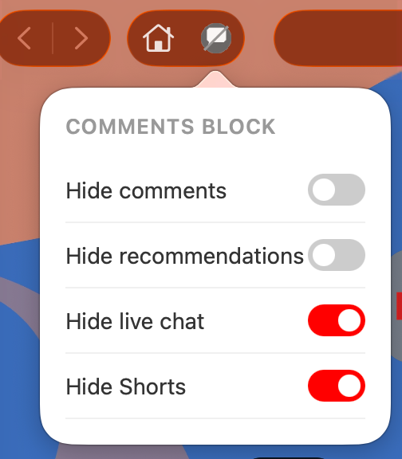
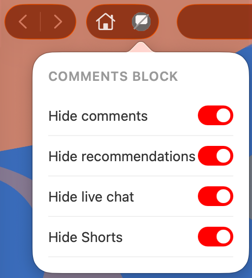

# Comments Block

A browser extension that hides distracting YouTube UI elements. Toggled per-feature from the browser toolbar. Works in **Chrome**, **Firefox**, and **Safari**.

## Repo layout

```
comments-block/
├── extension/        # Web extension source — used by Chrome, Firefox, and Safari
│   ├── manifest.json
│   ├── content.js
│   ├── popup.html / popup.js
│   └── icon-*.png
├── Comments Block/   # Safari wrapper (Xcode project, generated from extension/)
└── screenshots/
```

Chrome and Firefox load the `extension/` folder directly. Safari wraps it in an Xcode project hosted by a small native app.

---

## Chrome

**Requirements:** Chrome 88 or later (Manifest V3 support)

1. Clone the repo (or download and unzip it):

   ```bash
   git clone https://github.com/parmsam/comments-block.git
   ```

2. Open `chrome://extensions` in Chrome.

3. Enable **Developer mode** (toggle in the top-right corner).

4. Click **Load unpacked** and select the `extension/` folder.

The **Comments Block** icon will appear in your toolbar. Pin it from the puzzle-piece menu if it's hidden.

> **Note:** Unsigned extensions loaded this way stay installed until you remove them, but Chrome may show a warning on startup. To distribute the extension without warnings, publish it to the [Chrome Web Store](https://chrome.google.com/webstore/devconsole).

---

## Firefox

**Requirements:** Firefox 109 or later (Manifest V3 support)

### Temporary install (development)

1. Open `about:debugging` in Firefox.
2. Click **This Firefox** in the left sidebar.
3. Click **Load Temporary Add-on…** and select `extension/manifest.json`.

The extension is removed when Firefox restarts.

### Development with web-ext

Install [`web-ext`](https://extensionworkshop.com/documentation/develop/getting-started-with-web-ext/) globally:

```bash
npm install --global web-ext
```

Run the extension in a temporary Firefox profile (auto-reloads on file changes):

```bash
cd extension
web-ext run
```

### Sideloading (self-distribution)

Unlike Chrome (load unpacked) and Safari (allow unsigned extensions), Firefox requires all persistent extensions to be signed by Mozilla — even for self-distribution. To share the extension as a `.xpi` file without a public AMO listing, sign it as an unlisted add-on. You'll need [AMO API credentials](https://addons.mozilla.org/developers/addon/api/key/).

```bash
cd extension
web-ext build        # produces web-ext-artifacts/comments_block-1.0.zip
web-ext sign --channel=unlisted --api-key=... --api-secret=...
```

This produces a signed `.xpi` that users can install via **File → Open File…** in Firefox. The add-on won't appear in public AMO search results.

### Submit to Firefox Add-ons (AMO)

To publish the extension publicly on [addons.mozilla.org](https://addons.mozilla.org):

1. Build the package:
   ```bash
   cd extension
   web-ext build
   ```
2. Go to [addons.mozilla.org/developers](https://addons.mozilla.org/developers/), click **Submit a New Add-on**, and upload the `.zip` from `web-ext-artifacts/`.

Alternatively, sign and submit in one step using the CLI:

```bash
web-ext sign --channel=listed --api-key=... --api-secret=...
```

---

## Safari

**Requirements:** macOS 12 or later · Safari 15 or later · Xcode 13 or later (free from the [App Store](https://apps.apple.com/us/app/xcode/id497799835))

The `Comments Block/` directory in this repo is a pre-generated Xcode project. You can open it directly (step 3 below) or regenerate it from scratch with `safari-web-extension-converter`.

**1. Clone the repo**

```bash
git clone https://github.com/parmsam/comments-block.git
cd comments-block
```

**2. (Optional) Regenerate the Xcode project**

Replace `com.example.comments-block` with a bundle identifier of your own (e.g. `com.yourname.comments-block`).

```bash
xcrun safari-web-extension-converter \
  extension \
  --app-name "Comments Block" \
  --bundle-identifier com.example.comments-block \
  --swift \
  --project-location . \
  --no-open
```

**3. Open the project and run it**

```bash
open "Comments Block/Comments Block.xcodeproj"
```

In Xcode, press **⌘R** to build and run. This installs a small wrapper app that hosts the extension. Keep Safari open during the build so the extension registers correctly.

**4. Allow unsigned extensions**

Safari blocks unsigned extensions by default. To enable them:

1. Open **Safari → Settings → Advanced** and check **Show Developer menu in menu bar**
2. Open the **Developer** menu and click **Allow Unsigned Extensions**
3. Open **Safari → Settings → Extensions**, enable **Comments Block**, and grant it permission for `youtube.com`

> **Note:** "Allow Unsigned Extensions" resets every time Safari restarts — re-enable it from the Developer menu each session. The extension itself stays installed and your toggle settings are remembered. To skip this step permanently, sign the extension with an [Apple Developer account](https://developer.apple.com/programs/) ($99/year).

---

## Usage

| Some toggles on | All toggles on |
|---|---|
|  |  |

Click the **Comments Block** icon in the browser toolbar to toggle:

- **Hide comments** — removes the comment section below videos (on by default)
- **Hide recommendations** — removes the suggested videos sidebar (off by default)
- **Hide live chat** — removes the live chat panel on streams (off by default)
- **Hide Shorts** — removes the Shorts shelves from the homepage and feed (off by default)

Settings are saved per-browser and apply immediately without a page reload.

---

## Uninstall

**Chrome:** Open `chrome://extensions`, find Comments Block, and click **Remove**.

**Firefox:** Open `about:addons`, find Comments Block, and click **Remove**.

**Safari:**
1. Open **Safari → Settings → Extensions**, disable **Comments Block**, then click **Uninstall**.
2. Delete the wrapper app from `/Applications` (or wherever Xcode installed it).
